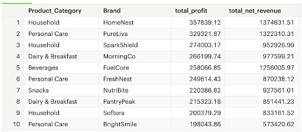
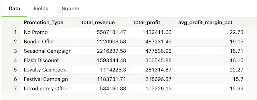
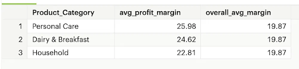
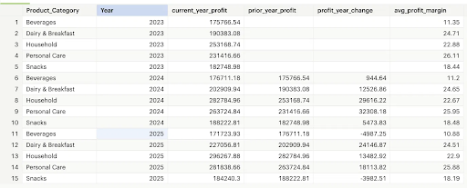
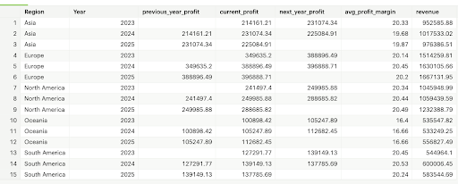
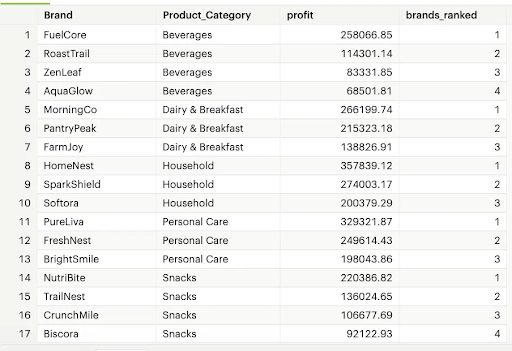

# Analysis Findings Summary

## Q1: Category & Brand Profitability
Household and Personal Care brands dominate the top 10 most profitable brand-category combinations. HomeNest (Household) leads with $357.8K in total profit, followed closely by PureLiva (Personal Care) at $329.3K. However, PureLiva generates the highest revenue at $1.32M while also ranking 2nd in profit, making it the strongest overall performer by both metrics. This signals demand and profitability.

FuelCore (Beverages) ranks 5th in profit but 3rd in revenue at $1.26M, confirming the beverage category's high-volume, lower-margin dynamic compared to Personal Care.

## Q2: Promotion Type Effectiveness
No Promo dominates all three metrics, with $5.59M in revenue, $1.43M in profit, and 22.73% average margin. Transactions without promotions preserve full margin, making profit per transaction consistently higher than any promotional type.

Bundle Offer and Seasonal Campaign are the top promotional drivers by both revenue (both $2.22M) and profit ($487.23K and $477.54K respectively), suggesting these formats generate strong volume without heavily compressing margin. Not to mention Bundle Offer and Seasonal Campaign have the third and fourth largest profit margin percentages (19.15% and 18.71% respectively) across all promotional types.

Loyalty Cashback ranks 5th in total profit but carries the second highest margin percentage at 22.27%, nearly matching No Promo. This signals that loyalty programs protect margin while still driving transactions, making it worth investing in expanding the loyalty customer base.

Introductory Offer and Flash Discount carry the lowest margin percentages at 15.99% and 16.15%, which aligns with their purpose. These promotion types focus on getting new customers in the door and clearing slow-moving inventory rather than maximizing per-transaction profitability.

## Q3: Categories Above Average Profit Margin
3 of 5 product categories exceed the overall average profit margin of 19.87%. Personal Care leads at 25.98%, followed by Dairy & Breakfast at 24.62%, and Household at 22.81%

Beverages falls significantly below the benchmark at 11.15%, driven more by volume rather than margin efficiency. Snacks are the next lowest at 18.37%. The gap between the top and bottom categories is nearly 15%, suggesting meaningful differences in pricing power and cost structure across the portfolio.

## Q4: Category Profitability Trends
Household, personal care, and dairy & breakfast saw profit increases year over year. Household and Personal care are the largest drivers of profit, while dairy & breakfast and personal care products drive the largest profit margins. Dairy & breakfast had the strongest growth trajectory of any category, with profit change nearly doubling from $12.53K in 2024 to $24.15K in 2025.

Beverages and snacks generated positive profit each year, although in 2025 both experienced lower profit than the preceding year. Hypothesized in part due to the economic headwinds in 2025 such as the supply chain crisis that was felt globally. In 2024, beverages only grew profits by $944.64 compared to 2023, driven in part by the high-volume, low-margin nature of the beverage category.

## Q5: Regional Growth & Profitability
Europe and North America are the strongest performing regions, growing profit consistently each year. North America showed the most significant acceleration, jumping from $249.99K in 2024 to $288.69K in 2025. Europe leads all regions in both total profit and revenue, generating $396.89K in profit and $1.67M in revenue in 2025.

Asia and South America both grew in 2024 but declined slightly in 2025, suggesting sensitivity to broader market conditions. South America is notable for carrying the second highest profit margins (20.24-20.53%) despite inconsistent revenue growth, signaling strong margin efficiency that is not yet translating to sustained volume.

Oceania is the smallest region by revenue but grew profit consistently across all three years, making it a stable if modest contributor.

## Q6: Brand Ranking by Category
Household and Personal Care hold the highest profit brands across all categories. HomeNest (Household) leads all brands at $357.84K in total profit, followed by PureLiva (Personal Care) at $329.32K.

FuelCore dominates the Beverage category, generating $258.07K in profit compared to the remaining three Beverage brands combined at $266.13K, nearly matching all competitors combined despite the category's high-volume, low-margin structure.

MorningCo leads Dairy & Breakfast at $266.20K, outpacing second-ranked PantryPeak by $50.88K, signaling a clear category leader in a consistently growing segment.

NutriBite leads the Snacks category at $220.39K, outperforming second-ranked TrailNest by $84.36K. Biscora trails significantly at $92.12K, suggesting meaningful brand-level performance gaps within the Snacks category.

Beverages remains the lowest profit category overall, though FuelCore's dominance signals concentrated strength at the top of a volume-driven market.

